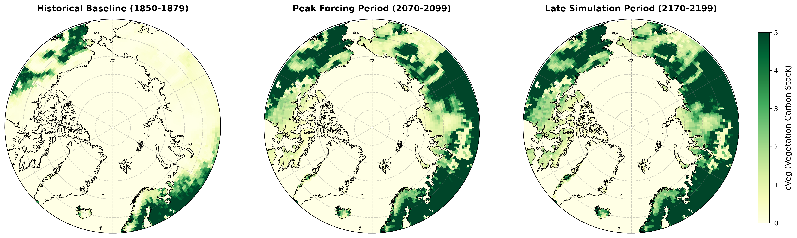

# High-Latitude Vegetation Carbon (cVeg) Spatial-Temporal Analysis Pipeline

A Python-based workflow for preprocessing, spatial aggregation, and visualization of high-latitude vegetation carbon (`cVeg`) dynamics using ESM/CMIP6 model outputs.

## Features
- **Data Standardization**: Integrated with `xmip` for seamless preprocessing of Earth System Model (ESM) grid topologies.
- **Area-Weighted Aggregation**: Implemented cosine latitude-weighting for accurate high-latitude vegetation carbon stock calculation.
- **Polar Stereographic Visualization**: Multi-epoch spatial dynamics rendered using Cartopy polar projection (`NorthPolarStereo`).

## Sample Output


## Environment Setup
To run this workflow, please set up the environment via Conda:
```bash
conda env create -f environment.yml
conda activate tipping-analysis
```

## Data Availability
Due to GitHub file size limits, input data (*.nc) is not tracked in this repository.
The CMIP6 raw data can be accessed directly via ESGF Portal.
